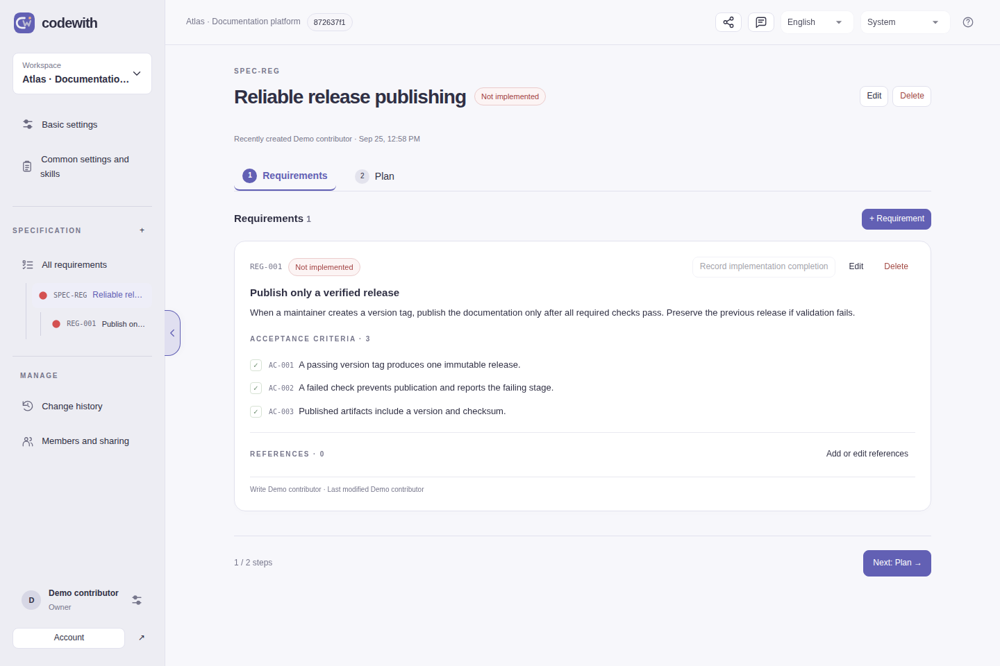
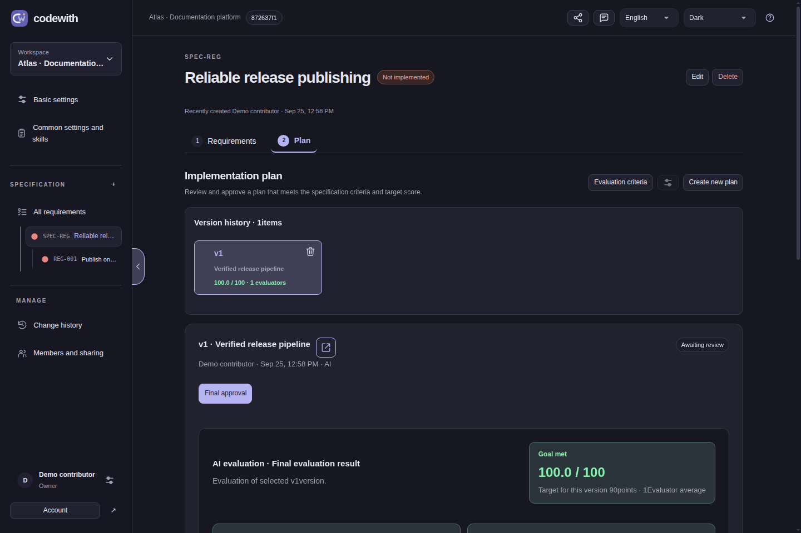
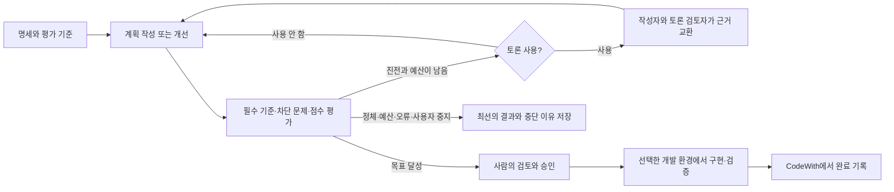

<div align="center">
  
  <h1>CodeWith</h1>
  <p><strong>요구사항을 검토하고 평가하고 승인할 수 있는 계획으로.</strong></p>
  <p><a href="README.md">English</a> · <a href="README.ko.md">한국어</a></p>
  <p>
    <a href="https://github.com/jjjuuuun/codewith/actions/workflows/ci.yml"></a>
    <a href="https://github.com/jjjuuuun/codewith/releases"></a>
    <a href="LICENSE"></a>
    
  </p>
</div>

CodeWith는 명세 작성, AI 구현 계획, 사람의 검토를 위한 자체 호스팅 웹 앱입니다. 완료 기준을 정의하고 자신의 AI 계정을 연결해 평가 기준에 따라 계획을 개선하며, 결정의 근거를 문서와 함께 남깁니다.

**앱 하나, 서버 하나로 실행합니다.** IDE 플러그인이나 별도 로컬 브리지는 필요하지 않습니다. 승인한 계획을 실제로 구현하고 테스트할 개발 환경은 사용자가 선택합니다.



_실제 앱에 가상 예제 데이터를 넣어 촬영했습니다. 예제 평가 점수는 실제 프로젝트 테스트 실행의 증거가 아닙니다._

## 주요 기능

- **명세 작성:** 요구사항, 완료 기준, 질문, 작업, 참고 코드와 자료를 한 워크스페이스에서 관리합니다.
- **AI 계획:** Codex, Claude Code, 지원되는 OpenAI·Anthropic API에 연결합니다. AI 연결과 인증 정보는 사용자별로 분리합니다.
- **평가와 개선:** 평가 항목과 배점, 필수 기준, 차단 문제, 목표 점수를 설정합니다. **시스템 → 워크스페이스 → 명세** 순서로 상위 설정을 이어받습니다.
- **루프 진행 확인:** 에이전트 응답, 확인 질문, 개선 이력, 점수와 중단 이유를 확인합니다.
- **검토 후 승인:** HTML 계획 버전에서 BEFORE/AFTER 코드, UI 목업, DB 변경과 검증 계획을 검토하고 최종 버전을 선택합니다.
- **개인·팀 사용:** personal/shared/server 모드, 역할, 초대 코드, 변경 이력과 JSON·HTML 내보내기를 제공합니다.
- **구현 완료 기록:** 사용자의 개발 환경에서 구현·검증한 뒤, 승인 계획에 대한 검증 요약을 브라우저에서 직접 남깁니다.
- **화면 설정:** 기본 영어, 한국어 전환, 라이트·다크·시스템 테마와 반응형 화면을 지원합니다.



## 계획 루프

계획 실행 설정에서 **에이전트 토론**을 켜면 작성자와 토론 검토자가 평가 지적에 대해 질문·반박·답변한 뒤 계획을 수정합니다. 기본값은 꺼짐이며 두 후보 모드 모두 지원합니다. 토론을 켜면 토론 검토자 수(1~3명, 기본 1명)와 모델을 최종 평가자와 별도로 설정할 수 있습니다. 모델을 지정하지 않으면 현재 선택한 AI 모델을 사용합니다. 고정 토론 횟수 없이 합의, 새 근거 없음, 호출 예산에 따라 수정으로 넘어갑니다. 토론도 전체 호출·시간 예산에 포함되며 수정·독립 재평가 호출을 남겨둡니다. 토론 기록과 미해결 쟁점은 계획에 보존하고, 새 평가 세션에는 토론 기록을 전달하지 않습니다.

| 역할        | 설정과 책임                                                                |
| ----------- | -------------------------------------------------------------------------- |
| 작성자      | 단일 계획은 1명, 후보 비교는 2~4명으로 계획을 작성·수정합니다.             |
| 토론 검토자 | 1~3명과 각 모델을 별도로 선택하며, 작성자와 질문·반박·답변을 주고받습니다. |
| 최종 평가자 | 기존 인원·모델 설정을 유지하며 토론 기록 없이 새 세션에서 독립 채점합니다. |

기존 설정과 저장된 계획을 유지합니다. 새 토론 설정이 없으면 검토자 1명과 현재 선택한 AI 모델을 기본값으로 사용합니다. 토론으로 명세·배점·목표나 사용자 승인 기준을 변경하지 않습니다.



기본 목표는 **90/100점**입니다. 점수만 높다고 통과하지 않으며 필수 기준을 충족하고 차단 문제를 해결해야 합니다. 진전이 없거나 예산이 끝나거나 오류·중지 요청이 발생하면 목표 전에 멈출 수 있습니다. 계획 저장은 자동 승인이 아니고, AI 점수는 테스트 결과가 아닙니다.

## 소스로 실행

**Node.js 22.13 이상**과 npm이 필요합니다. CI에서 Node.js 22·24를 검사합니다.

```sh
git clone https://github.com/jjjuuuun/codewith.git
cd codewith
npm ci
npm run build
npm start
```

**http://127.0.0.1:4310**에 접속합니다. 기본 personal 모드는 현재 PC에서 사용하며 실행 데이터는 `.codewith/`에 생성됩니다. 기존 계정·문서·인증 정보는 배포물에 포함하지 않습니다.

개발 중 자동 갱신이 필요하면 다음 명령을 사용합니다.

```sh
npm run dev
```

소스를 수정한 후 운영 실행할 때는 다시 빌드합니다. `.env.example`은 설정 참고 파일이며 기본 로컬 실행에 복사는 필수가 아닙니다.

## 릴리스 설치

[Releases](https://github.com/jjjuuuun/codewith/releases/tag/v0.2.0)에서 `codewith-0.2.0.zip`을 내려받아 압축을 해제합니다.

```sh
cd codewith-0.2.0
npm ci --omit=dev
npm start
```

ZIP에는 빌드된 화면, 서버 코드, lockfile과 기본 스킬이 들어 있습니다. Node.js와 의존성은 별도 설치합니다.

### npm 패키지

패키지는 npmjs.org가 아닌 **GitHub Packages**의 npm 레지스트리에 게시합니다. GitHub는 공개 npm 패키지도 설치 시 레지스트리 인증을 요구합니다. 인증 없이 내려받으려면 릴리스 ZIP을 사용하세요. [패키지 설치 안내](docs/installation.md#github-packages)를 참고하세요.

```sh
npm install --global @jjjuuuun/codewith@0.2.0 --registry=https://npm.pkg.github.com
mkdir my-codewith
cd my-codewith
codewith
```

CLI는 현재 폴더의 `.env`를 읽고 `./.codewith`에 데이터를 저장합니다. `CODEWITH_DATA_DIR`을 지정하면 해당 경로를 사용합니다. `codewith --help`에서 실행 옵션을 확인할 수 있습니다.

## AI 연결

개인 설정에서 사용할 AI를 연결합니다. **AI 이용권은 포함하지 않습니다.** 자신의 공급자 계정 또는 API 키와 적절한 이용 권한이 필요합니다.

| 연결 방식            | 서버에 필요한 것                                |
| -------------------- | ----------------------------------------------- |
| Codex 계정           | 공식 Codex CLI 또는 `CODEWITH_CODEX_BIN`        |
| Claude Code 계정     | 공식 Claude Code CLI 또는 `CODEWITH_CLAUDE_BIN` |
| OpenAI·Anthropic API | 지원되는 계정과 API 키. CLI 불필요              |

shared/server 모드에서는 각 접속자의 PC가 아닌 **CodeWith 서버**에 CLI를 설치합니다. 프로젝트 폴더도 서버가 읽을 수 있어야 합니다. 서버가 로컬 프로젝트에 접근하지 못하면 브라우저 폴더 가져오기를 사용할 수 있습니다.

앱의 **AI 연결 안내**에서 인증·모델 선택·연결 문제 해결을 확인하세요.

## 운영과 데이터

| 모드       | 용도                  | 앱 로그인                      |
| ---------- | --------------------- | ------------------------------ |
| `personal` | 현재 PC에서 개인 사용 | 별도 계정 로그인 없이 진입     |
| `shared`   | 팀 공유 설치          | 로그인 키                      |
| `server`   | 관리형 서버 운영      | key·passkey·email·OIDC 중 설정 |

신뢰할 수 있는 HTTPS 주소에서 서버를 운영하는 예시입니다.

```dotenv
CODEWITH_MODE=server
CODEWITH_ORIGIN=https://codewith.example.com
CODEWITH_AUTH_METHODS=key,passkey
CODEWITH_DATA_DIR=/srv/codewith/data
HOST=127.0.0.1
PORT=4310
```

역방향 프록시를 사용하거나 `CODEWITH_TLS_CERT`·`CODEWITH_TLS_KEY`로 직접 TLS를 제공합니다. 패스키는 신뢰할 수 있는 HTTPS 도메인이 필요하며 개발용 `http://localhost`는 예외입니다. 인증서 경고를 무시하는 것만으로는 신뢰 설정을 대신할 수 없습니다.

기본 파일 저장 외에 SQLite, PostgreSQL, MySQL/MariaDB와 사용자 어댑터 인터페이스를 지원합니다. 저장소당 앱 서버 하나로 운영하고, 인증·첨부 파일을 포함한 데이터 폴더와 외부 DB를 함께 백업합니다. [설치·운영 안내](docs/installation.md), [설정 참고](config/README.md)를 확인하세요.

## 개발과 검증

```sh
npm ci
npm run format:check
npm run lint
npm run check
npm test
npx playwright install chromium
npm run test:browser
npm run test:browser:i18n
npm audit --audit-level=high
npm run release:check
npm run release:bundle
```

테스트는 임시 저장소와 테스트 AI 공급자를 사용하며 실제 `.codewith` 데이터나 유료 AI 요청을 사용하지 않습니다. 브라우저 테스트는 가상 패스키 인증기를 포함합니다. 실제 AI·메일·OIDC·휴대폰 패스키 연동은 배포 환경에서 별도로 확인해야 합니다.

GitHub Actions는 포맷, lint, 문법, 단위·통합 테스트, 빌드, 브라우저, 의존성 취약점, 민감정보와 패키지 설치·실행을 검사합니다. 버전 태그 배포도 검증이 모두 통과한 뒤 npm 패키지와 체크섬을 포함한 ZIP을 게시합니다. [CI·릴리스 안내](docs/releasing.md)를 참고하세요.

## 프로젝트 범위

CodeWith는 명세·계획·검토·완료 기록을 관리합니다. 실제 구현과 테스트 실행은 사용자의 개발 환경에서 수행합니다. 네이티브 AI 채팅은 설정된 도구 권한 범위에서 작업을 제안할 수 있으며 연결 프로젝트 파일 변경에는 명시적 승인 절차가 적용됩니다. IDE 확장이나 별도 상주 프로그램은 포함하지 않습니다.

- [구조와 단일 앱 점검](docs/architecture.md)
- [0.1.0 공개 전 점검](docs/release-audit.md)
- [기여 안내](CONTRIBUTING.md)
- [보안 제보](SECURITY.md)
- [변경 이력](CHANGELOG.md)

## 라이선스

[MIT](LICENSE). 상업적 사용을 포함해 사용·수정·재배포할 수 있습니다. 사본 또는 소프트웨어의 상당 부분에 저작권 표시와 MIT 라이선스 문구를 유지하세요. 외부 의존성에는 각각의 라이선스가 적용됩니다.

[외부 의존성 라이선스](THIRD_PARTY_NOTICES.md)는 별도로 적용됩니다.
