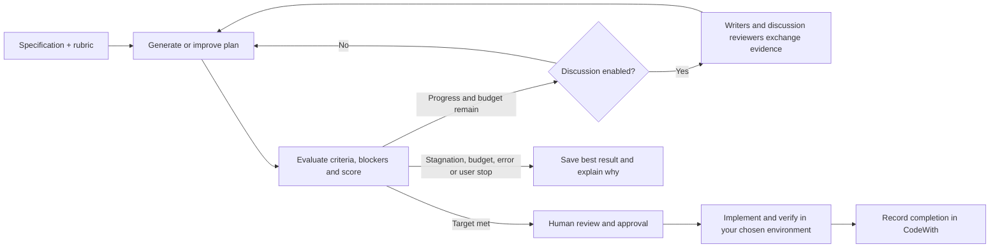

<div align="center">
  
  <h1>CodeWith</h1>
  <p><strong>Turn requirements into plans you can inspect, evaluate, and approve.</strong></p>
  <p><a href="README.md">English</a> · <a href="README.ko.md">한국어</a></p>
  <p>
    <a href="https://github.com/jjjuuuun/codewith/actions/workflows/ci.yml"></a>
    <a href="https://github.com/jjjuuuun/codewith/releases"></a>
    <a href="LICENSE"></a>
    
  </p>
</div>

CodeWith is a self-hosted web app for specifications, AI-assisted implementation plans, and human review. Define acceptance criteria, connect your own AI account, improve a plan against a configurable rubric, and keep the decisions with the document.

**One application, one server.** No IDE plugin or separate local bridge is required. You choose where to implement and test the approved plan.


_Real application screens with synthetic demonstration data. Example assessments are not evidence of actual project test execution._

## What you can do

- **Write specifications:** requirements, acceptance criteria, questions, tasks, reference files, and rich text in one workspace.
- **Plan with AI:** use Codex, Claude Code, or supported direct OpenAI/Anthropic API connections. Connections and credentials belong to each user.
- **Evaluate and improve:** configure scoring items and weights, required criteria, blockers, and a target score. Settings inherit **system → workspace → specification**.
- **Inspect the loop:** follow agent responses, clarification questions, improvement history, scores, and explicit stop reasons.
- **Review before approval:** inspect versioned HTML plans, before/after code, mockups, database changes, and verification steps. Record comments and choose the final version.
- **Work independently or with a team:** personal, shared, and server modes; workspace roles, invitation codes, history, and JSON/HTML exports.
- **Record implementation results:** after implementing in your development environment, record a verification summary against the approved plan directly in the browser.
- **Choose your display:** English by default, Korean on demand, light/dark/system themes, and responsive layouts.


## How the planning loop works

Version 0.2.0 adds optional agent discussion. In **Plan execution settings**, enable **Agent discussion** and choose discussion reviewers separately from final evaluators.

| Role                 | Configuration and responsibility                                                                                               |
| -------------------- | ------------------------------------------------------------------------------------------------------------------------------ |
| Writers              | One writer for a single plan, or 2–4 for candidate comparison; draft and revise the plan.                                      |
| Discussion reviewers | 1–3 reviewers with individually selected models; question assumptions, respond to writers, and identify unresolved issues.     |
| Final evaluators     | Existing evaluator count and model settings; independently score the plan in fresh sessions without the discussion transcript. |

Discussion has no fixed turn limit. Participants take turns until they agree to revise, a full cycle produces no new evidence, or the remaining call budget must be reserved for revision and evaluation. All calls share the existing call/time budgets. Discussion history and unresolved issues are saved with the plan.

Discussion is off by default. Existing settings and saved plans remain compatible; missing discussion settings default to one reviewer using the currently selected AI model. The specification, scoring rubric, target and human approval requirements stay fixed.



The default target is **90/100**. A high score alone is insufficient: required criteria must pass and blockers must be resolved. The loop can stop before the target when progress stalls, a budget is exhausted, execution fails, or the user stops it. A saved plan is not automatically approved, and an AI score is not a test result.

## Quick start from source

Requires **Node.js 22.13+** and npm. Node.js 22 and 24 are covered by CI.

```sh
git clone https://github.com/jjjuuuun/codewith.git
cd codewith
npm ci
npm run build
npm start
```

Open **http://127.0.0.1:4310**. The default personal mode stays on your computer. Runtime data is created in `.codewith/`; no existing accounts, documents, or credentials are distributed.

For development with hot reload:

```sh
npm run dev
```

After editing source files, rebuild before using `npm start`. Use `.env.example` as a configuration reference; copying it is optional for the default local setup.

## Install a release

Download `codewith-0.2.0.zip` from [Releases](https://github.com/jjjuuuun/codewith/releases/tag/v0.2.0), extract it, then run:

```sh
cd codewith-0.2.0
npm ci --omit=dev
npm start
```

The release ZIP includes the built frontend, runtime source, lockfile, and default skills. Node.js and dependencies are installed separately.

### npm package

The scoped npm package is published through **GitHub Packages**, not npmjs.org. GitHub requires registry authentication even for public npm packages; the release ZIP is available without registry authentication. See [package installation](docs/installation.md#github-packages).

```sh
npm install --global @jjjuuuun/codewith@0.2.0 --registry=https://npm.pkg.github.com
mkdir my-codewith
cd my-codewith
codewith
```

The CLI reads `.env` in the current directory and stores data in `./.codewith`, or in `CODEWITH_DATA_DIR` when configured. `codewith --help` lists startup options.

## AI connections

Open personal settings and connect the provider you want to use. **AI access is not bundled**; you need your own provider account or API key and applicable usage entitlement.

| Connection             | Server requirement                                           |
| ---------------------- | ------------------------------------------------------------ |
| Codex account          | Official Codex CLI on `PATH`, or `CODEWITH_CODEX_BIN`        |
| Claude Code account    | Official Claude Code CLI on `PATH`, or `CODEWITH_CLAUDE_BIN` |
| OpenAI / Anthropic API | A supported account and API key; no CLI required             |

In shared/server mode, install CLIs on the **CodeWith server**, not every browser user's computer. Project folders must also be accessible to that server. Browser folder import is available when the server cannot read your local project.

The in-app **AI connection guide** explains authentication, model selection, and connection troubleshooting.

## Deployment and data

| Mode       | Intended use                    | App sign-in                                        |
| ---------- | ------------------------------- | -------------------------------------------------- |
| `personal` | One person on this computer     | Local entry, no account sign-in                    |
| `shared`   | A shared workspace installation | Login keys                                         |
| `server`   | A managed server                | Configurable key, passkey, email, and OIDC methods |

For example, configure server mode with a trusted HTTPS origin:

```dotenv
CODEWITH_MODE=server
CODEWITH_ORIGIN=https://codewith.example.com
CODEWITH_AUTH_METHODS=key,passkey
CODEWITH_DATA_DIR=/srv/codewith/data
HOST=127.0.0.1
PORT=4310
```

Place a reverse proxy in front of the server, or configure `CODEWITH_TLS_CERT` and `CODEWITH_TLS_KEY` for native TLS. Passkeys require a trusted HTTPS domain, with `http://localhost` allowed for development. Bypassing a certificate warning is not a substitute for a trusted certificate.

File storage is the default. SQLite, PostgreSQL, MySQL/MariaDB, and a custom adapter interface are available. Run one application server per store; back up the data directory and external database, including authentication and uploaded files. See [installation and deployment](docs/installation.md) and [configuration reference](config/README.md).

## Development and checks

```sh
npm ci
npm run format:check
npm run lint
npm run check
npm test
npx playwright install chromium
npm run test:browser
npm run test:browser:i18n
npm audit --audit-level=high
npm run release:check
npm run release:bundle
```

Tests use temporary stores and test AI providers. They do not use your `.codewith` data or spend credits on real AI requests. Browser tests include a virtual passkey authenticator; live external AI, mail, OIDC, and physical phone passkeys still need deployment-specific checks.

GitHub Actions runs formatting, lint, syntax checks, unit/integration tests, production build, browser checks, dependency auditing, secret checks, and packaged-install smoke tests. A version tag publishes the verified npm package and checksummed ZIP only after the release checks pass. See [CI and release workflow](docs/releasing.md).

## Project boundaries

CodeWith owns the specification, planning, review, and completion record. Your development environment owns actual implementation and test execution. Native AI chat can offer actions within its configured tool permissions; changes to connected project files still follow explicit approval checks. There is no bundled IDE extension or companion daemon.

- [Architecture and standalone audit](docs/architecture.md)
- [0.1.0 release review](docs/release-audit.md)
- [Contributing](CONTRIBUTING.md)
- [Security reporting](SECURITY.md)
- [Changelog](CHANGELOG.md)

## License

[MIT](LICENSE). You may use, modify, and redistribute CodeWith, including commercially. Retain the copyright notice and MIT license text in copies or substantial portions. Third-party dependencies retain their own licenses.

[External dependency licenses](THIRD_PARTY_NOTICES.md) apply separately.
