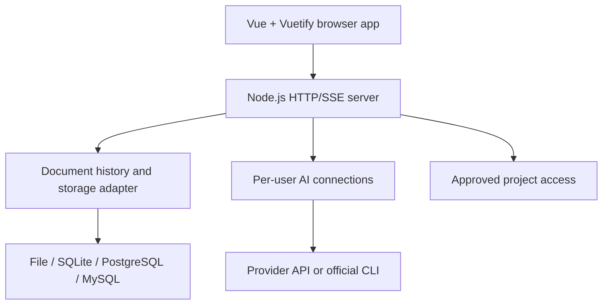

# Architecture

CodeWith is one Node.js application serving a Vue web frontend and its HTTP/SSE API. Personal, shared, and server are deployment modes of the same program.

| Location           | Responsibility                                                               |
| ------------------ | ---------------------------------------------------------------------------- |
| `src/`             | UI, editor state, actions, translation, client API calls                     |
| `server/`          | Authentication, authorization, planning jobs, persistence and project access |
| `shared/`          | Document contracts, validation, evaluation policy and rendering rules        |
| `skills/defaults/` | Default planning instructions shipped with the app                           |
| `public/`          | Static assets and generated editor/authentication bundles                    |
| `bin/`             | npm command entry point                                                      |
| `tests/`           | Temporary-store tests and simulated providers                                |

## Standalone boundary

The browser can create specifications, generate and assess plans, review and approve versions, and record implementation completion. It does not require an IDE extension or a second local server.

Actual implementation and project testing belong to the development environment chosen by the user. An AI assessment and a human completion record are distinct from executed test evidence. Native AI chat can request configured tools; its approval and filesystem boundaries still apply.

The completion endpoint remains an application API. It checks workspace permission, current document head, requirement version, approved plan identity, and plan freshness. Repeated identical completion events are idempotent. The browser uses this endpoint instead of directly modifying status in a document PATCH.

## Removed legacy coupling in 0.1.0

- Removed the unused port-4311 local bridge and its separate identity/Claude wrapper.
- Removed the old Ed25519 challenge/verify implementation. Those routes now return `410`; normal login-key creation/login and passkeys are retained.
- Updated test login helpers to exercise the real supported key flow.
- Removed plugin-only planning instructions, approval copy, and the unimplemented IDE-plugin guide.
- Added browser completion reporting so the lifecycle is usable without a plugin.

Legacy document normalization remains where it preserves existing data. Stored personal credentials, workspace files, and edited skills are not reset as part of publication. Vue/Vite/ProseMirror “plugins” are internal framework mechanisms, not a second distributed application.

## State and isolation

- User authentication and AI credentials stay in private runtime storage, outside source control and release packages.
- Workspaces have owner/editor/viewer permissions and optimistic revision checks.
- Personal mode is restricted to loopback. Shared/server access uses explicit app authentication.
- Plans are untrusted HTML data. Preview scripts remain blocked by sandbox/CSP controls.
- One server owns one store. Database adapters do not imply multi-server coordination or horizontal scaling.
